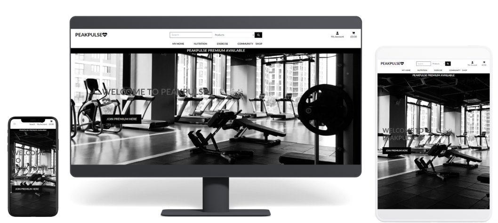
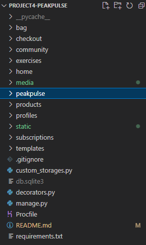
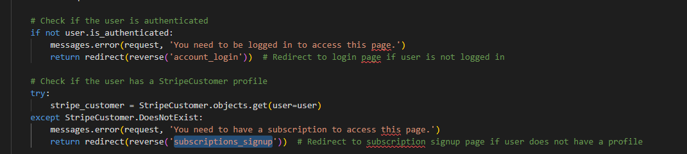
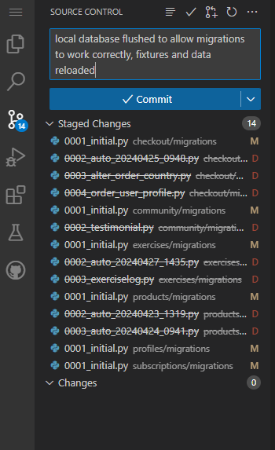
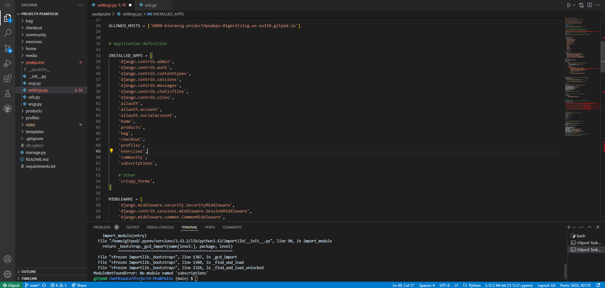
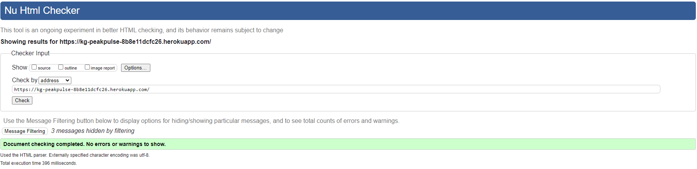
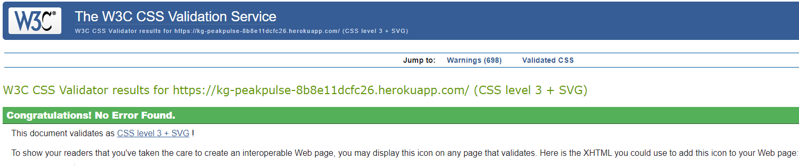
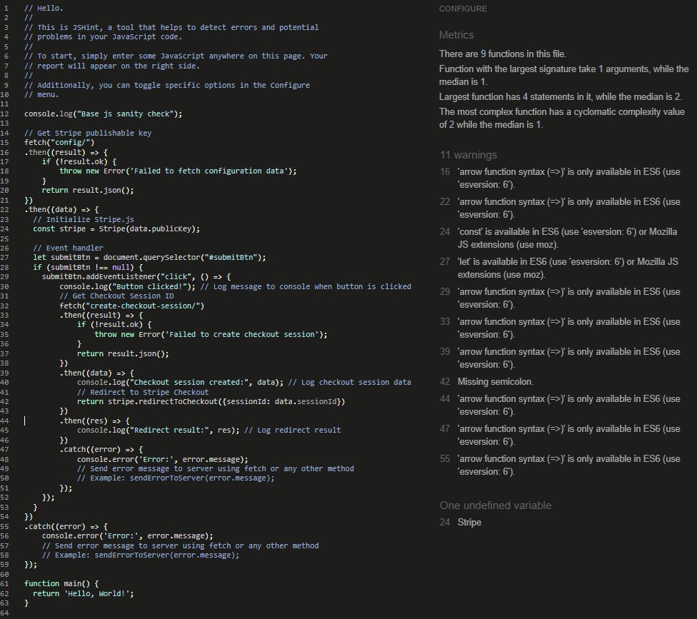
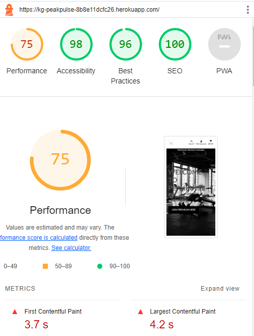

# PeakPulse

## Table of Contents
1. [Project Introduction](#project-introduction)
2. [UX](#ux)
   - [User Goals](#user-goals)
   - [Business Goals](#business-goals)
   - [User Stories](#user-stories)
3. [Design Choices](#design-choices)
   - [Wireframes](#wireframes)
   - [Root Directory](#root-directory)
4. [Features](#features)
   - [Existing Features](#existing-features)
   - [Features Left to Implement](#features-left-to-implement)
5. [Technologies Used](#technologies-used)
6. [Testing](#testing)
   - [Overview](#overview)
   - [Types of Tests](#types-of-tests)
   - [Test Cases](#test-cases)
   - [Continuous Integration (CI)](#continuous-integration-ci)
   - [Manual Testing](#manual-testing)
   - [Bug Tracking](#bug-tracking)
   - [Future Testing Plans](#future-testing-plans)
   - [W3 HTML Checker](#w3-html-checker)
   - [W3 CSS Checker](#w3-css-checker)
   - [JS Validator](#js-validator)
   - [Chrome Lighthouse Reporting](#chrome-lighthouse-reporting)
7. [Data Models](#data-models)
   - [Exercise Models](#exercise-models)
   - [Product Models](#product-models)
   - [Community Models](#community-models)
   - [User Profile Model](#user-profile-model)
   - [Signals](#signals)
8. [Deployment](#deployment)
9. [Credits](#credits)
   - [Contributors](#contributors)
   - [Inspirations](#inspirations)
   - [Special Thanks](#special-thanks)
   - [Tools Used](#tools-used)
   - [Color Reference](#color-reference)

## Project Introduction
This project is a the final project for my Nescot learning program. It is predominately designed to showcase a fullstack website built using Django and deployed to Heroku.
To view the deployed website click [PeakPulse Website](https://kg-peakpulse-8b8e11dcfc26.herokuapp.com/).

## UX

## User Goals
1. **Convenient Access to Gym Equipment**: As a fitness enthusiast, I want to browse and purchase gym equipment online, so I can conveniently access high-quality gear for my workouts.
2. **Effective Fitness Planning**: As a user, I want to access a database of exercises categorized by muscle group and equipment, so I can discover new workouts and plan my fitness routines effectively.
3. **Progress Tracking and Motivation**: As a fitness enthusiast, I want to log my own exercises and workouts, so I can track my progress and stay motivated to achieve my fitness goals.
4. **Community Engagement and Support**: As a community member, I want to engage with other users by leaving posts on a community wall, so I can share my fitness journey, ask questions, and provide support to fellow members.
5. **Sharing Satisfaction and Encouragement**: As a user, I want to leave testimonials about my experience with PeakPulse, so I can share my satisfaction with the platform and encourage others to join the community.
## Business Goals
1. **Increase Sales and Revenue**: The primary business goal is to increase sales of gym equipment by providing a convenient online platform for fitness enthusiasts to browse and purchase high-quality gear. By offering a diverse range of products and ensuring a seamless shopping experience, the website aims to drive sales and generate revenue.
2. **Enhance User Engagement and Retention**: Another key business goal is to enhance user engagement and retention by providing valuable features such as a database of exercises, workout logging capabilities, and a community wall for users to interact with each other. By offering these features, the website aims to keep users actively engaged with the platform, increasing the likelihood of repeat visits and long-term retention.
3. **Build Brand Reputation and Trust**: By allowing users to leave testimonials about their experience with PeakPulse, the website aims to build brand reputation and trust. Positive testimonials can serve as social proof, demonstrating the credibility and reliability of the platform to potential customers, ultimately leading to increased trust and brand loyalty.
4. **Drive Community Growth and Participation**: The website aims to foster a vibrant and supportive community of fitness enthusiasts by providing features such as a community wall for users to share their fitness journeys, ask questions, and provide support to each other. By encouraging community participation and engagement, the website aims to attract new users and retain existing ones, thereby driving overall growth and expansion of the user base.
5. **Gather User Insights and Feedback**: By allowing users to log their own exercises and workouts, the website can gather valuable insights and feedback about user preferences, behaviors, and satisfaction levels. This data can be used to refine and improve the platform, ensuring that it continues to meet the evolving needs and expectations of its users.
Overall, the business goals of the PeakPulse website encompass driving sales, enhancing user engagement and retention, building brand reputation and trust, fostering community growth and participation, and gathering valuable user insights and feedback to drive continuous improvement and innovation.

## User Stories
1. **As a fitness enthusiast, I want to browse and purchase gym equipment online, so I can conveniently access high-quality gear for my workouts.**
2. **As a user, I want to access a database of exercises categorized by muscle group and equipment, so I can discover new workouts and plan my fitness routines effectively.**
3. **As a fitness enthusiast, I want to log my own exercises and workouts, so I can track my progress and stay motivated to achieve my fitness goals.**
4. **As a community member, I want to engage with other users by leaving posts on a community wall, so I can share my fitness journey, ask questions, and provide support to fellow members.**
5. **As a user, I want to leave testimonials about my experience with PeakPulse, so I can share my satisfaction with the platform and encourage others to join the community.**

## Design Choices

1. **Minimalistic Design**: The design follows a minimalistic approach with a clean and uncluttered layout. This ensures that the content remains the focal point and enhances readability.

2. **Responsive Layout**: The template utilizes Bootstrap, a popular CSS framework, to ensure responsiveness across various devices and screen sizes. This allows the website to adapt seamlessly to different viewport dimensions, providing a consistent user experience.

3. **Clear Navigation**: The navigation menu is intuitive and easy to navigate, with collapsible options for smaller screens. This ensures that users can access different sections of the website effortlessly.

4. **Attention to Detail**: The design includes subtle elements such as icons, hover effects, and form styling to enhance user interaction and visual appeal. For example, the search form includes dropdown options for selecting the search category, improving usability.

5. **Branding Elements**: Branding elements like the logo and color scheme are consistent throughout the website, contributing to brand identity and recognition.

Overall, the design choice prioritizes user experience and accessibility while maintaining a visually appealing and cohesive aesthetic.

## Wireframes

- [Desktop Wireframe](media/readme_images/desktop-wireframe.png)
- [Tablet Wireframe](media/readme_images/tablet-wireframe.png)
- [Mobile Wireframe](media/readme_images/mobile-wireframe.png)
- [Product Mobile Wireframe](media/readme_images/product-mobile-wireframe.png)
- [Product Wireframe](media/readme_images/product-wireframe.png)
- [Exercise Wireframe](media/readme_images/exercise-database-wireframe.png)
- [Exercise Mobile Wireframe](media/readme_images/exercise-database-mobile-wireframe.png)
- [Testimonials Wireframe](media/readme_images/testimonials-wireframe.png)
- [Testimonials Mobile Wireframe](media/readme_images/testimonials-mobile-wireframe.png)

### Root Directory

## Features

### Existing Features

PeakPulse comprises 9 Django apps, each working harmoniously to deliver a seamless user experience, harnessing the power of Django. Their purposes are as follows:

- **Bag**: Manages the functionality of the user's bag, allowing products to be added, edited, and removed, preserving them throughout the user's session on the website.

- **Checkout**: Orchestrates the checkout experience, including data validation, handling webhooks, and caching the session.

- **Community**: Facilitates the functionality of the community wall where users can share their achievements with others. It also hosts a testimonials page where users can share their experiences with products or achieving their goals.

- **Exercises**: Contains a vast database of exercises accessible to subscribed users, complete with ratings and descriptions, enabling them to leverage this wealth of knowledge to advance their fitness goals. Additionally, it enables users to log their exercises.

- **Products**: Manages the database and functionality of the shopping platform, allowing users to browse, review, and purchase items. Superusers have the ability to modify and augment the catalogue.

- **Profiles**: Handles the functionality of user profiles across the site, enabling them to view and update their addresses, as well as review past orders.

- **Subscriptions**: Offers functionality for users to subscribe to a Premium service within the site, unlocking access to the exercise database and community wall. This incentivizes business growth and revenue.

Overall, these features collectively contribute to the robustness and richness of the PeakPulse platform, enhancing user engagement and satisfaction while driving business objectives.

### Features Left to Implement:

I had intended to include more apps allowing users to set dynamic goals as well as a nutrition database and log.

## Technologies Used

- **Django**: Django is a high-level Python web framework that encourages rapid development and clean, pragmatic design. It follows the DRY (Don't Repeat Yourself) principle, reducing the amount of code needed for common web development tasks and promoting code reusability.

- **Python**: Python is a versatile and beginner-friendly programming language known for its readability and simplicity. It offers a vast ecosystem of libraries and frameworks, making it ideal for web development projects like PeakPulse.

- **HTML/CSS/JavaScript**: These are the fundamental technologies for building web pages and adding interactivity to web applications. HTML provides the structure, CSS enhances the presentation and styling, and JavaScript adds dynamic behavior to the website, improving user experience.

- **PostgreSQL/SQLite**: PostgreSQL and SQLite are powerful relational database management systems (RDBMS) used for storing and managing data in the PeakPulse project. PostgreSQL offers advanced features like ACID compliance, while SQLite is lightweight and easy to set up, making it suitable for development and testing environments.

- **Crispy Forms**: Crispy Forms is a Django application that helps with rendering forms in a Bootstrap-friendly manner. It simplifies form styling and layout customization, enhancing the visual appeal and usability of forms in PeakPulse.

- **Django Allauth**: Django Allauth is a Django-based authentication app that provides robust user authentication, registration, and account management features out of the box. It saves development time and effort by handling common authentication tasks, such as login, logout, and password reset, with minimal configuration.

- **AWS (Amazon Web Services)**: AWS is a cloud computing platform that offers a wide range of services, including storage, compute, database, and networking services. PeakPulse utilizes AWS for static and media file storage, leveraging the scalability, reliability, and security features provided by AWS.

- **Stripe**: Stripe is a popular payment processing platform that enables businesses to accept payments securely online. Integrating Stripe into PeakPulse allows for seamless and secure payment transactions, enhancing the user experience and facilitating business transactions.

- **HTML**: Markup language for structuring web pages.

- **CSS**: Stylesheet language for styling HTML elements.

- **JavaScript**: Programming language for adding interactivity to web pages.

- **Bootstrap**: Front-end framework for building responsive websites. Provides pre-designed components for rapid development.

- **jQuery**: JavaScript library for simplifying DOM manipulation and event handling. Streamlines development with a concise API.

- **Git**: Distributed version control system for tracking changes in source code. Facilitates collaboration and code sharing among developers.

## Data Models
### Exercise Models
#### Exercise Category
- Represents categories of exercises.
- Attributes:
  - `name`: Name of the category.
  - `friendly_name`: Friendly name for display purposes.
3:30
#### Exercise
- Represents individual exercises logged by users.
- Attributes:
  - `user`: ForeignKey to link each exercise with a user.
  - `title`: Title of the exercise.
  - `description`: Description of the exercise.
  - `bodypart`: Body part targeted by the exercise.
  - `equipment`: Equipment required for the exercise.
  - `level`: Difficulty level of the exercise.
  - `rating`: Rating of the exercise.
  - `ratingdesc`: Description of the exercise rating.
  - `category`: ForeignKey to link each exercise with an ExerciseCategory.
  - Additional Fields:
    - `sets`: Number of sets performed.
    - `repetitions`: Number of repetitions per set.
    - `duration`: Duration of the exercise.
    - `weight`: Weight used for the exercise.
    - `distance`: Distance covered during the exercise.
    - `intensity`: Intensity level or heart rate.
    - `notes`: Additional notes or comments.
#### Exercise Log
- Represents logs of exercises performed by users.
- Attributes:
  - `user`: ForeignKey to link each log with a user.
  - `exercise`: ForeignKey to link each log with an Exercise.
  - `date`: Date of the exercise log.
  - `sets`: Number of sets performed.
  - `repetitions`: Number of repetitions per set.
  - `duration`: Duration of the exercise.
  - `weight`: Weight used for the exercise.
  - `distance`: Distance covered during the exercise.
  - `intensity`: Intensity level or heart rate.
  - `notes`: Additional notes or comments.
### Product Models
#### Category
- Represents categories of products available in the shop.
- Attributes:
  - `name`: Name of the category.
  - `friendly_name`: Friendly name for display purposes.
#### Product
- Represents individual products available for purchase.
- Attributes:
  - `category`: ForeignKey to link each product with a Category.
  - `sku`: Stock Keeping Unit for the product.
  - `name`: Name of the product.
  - `description`: Description of the product.
  - `has_sizes`: Indicates if the product comes in different sizes.
  - `price`: Price of the product.
  - `rating`: Rating of the product.
  - `image_url`: URL of the product image.
  - `image`: Image file of the product.
### Community Models
#### Post
- Represents posts created by users on the community wall.
- Attributes:
  - `user`: ForeignKey to link each post with a user.
  - `content`: Content of the post.
  - `created_at`: Date and time when the post was created.
#### Comment
- Represents comments left by users on posts.
- Attributes:
  - `user`: ForeignKey to link each comment with a user.
  - `post`: ForeignKey to link each comment with a post.
  - `content`: Content of the comment.
  - `created_at`: Date and time when the comment was created.
#### Testimonial
- Represents testimonials left by users.
- Attributes:
  - `user`: ForeignKey to link each testimonial with a user.
  - `content`: Content of the testimonial.
  - `created_at`: Date and time when the testimonial was created.
### User Profile Model
#### UserProfile
- Represents user profiles containing default delivery information and order history.
- Attributes:
  - `user`: OneToOneField linking each profile with a user.
  - `default_phone_number`: Default phone number for delivery.
  - `default_street_address1`: First line of default street address.
  - `default_street_address2`: Second line of default street address.
  - `default_town_or_city`: Default town or city for delivery.
  - `default_county`: Default county for delivery.
  - `default_postcode`: Default postcode for delivery.
  - `default_country`: Default country for delivery.
### Signals
- `create_or_update_user_profile`: Signal to create or update the user profile when a user is created or updated.

## Testing

### Overview
This project follows a comprehensive testing approach to ensure its reliability, stability, and functionality. The testing process includes unit tests, integration tests, and functional tests, along with manual testing procedures.

### Types of Tests
- **Unit Tests**: Test individual components and functions in isolation to ensure they work as expected.
- **Integration Tests**: Test interactions between different modules and components to verify seamless integration.
Each module followed the same inegration tests
- **Functional Tests**: Test the overall functionality of the application from the user's perspective.
- **User Acceptance Tests (UAT)**: Ensure that the application meets the requirements and expectations of end-users.

### Test Cases
Here are some examples of test cases implemented in the project:
- Test case 1: Ensure user authentication works correctly.
- Test case 2: Verify that products are added to the shopping cart accurately.
- Test case 3: Test the checkout process with valid and invalid inputs.
- Test case 4: Validate the functionality of the community wall and testimonials page.

### Continuous Integration (CI)
The project is integrated with continuous integration pipelines using GitHub Actions. These pipelines are triggered on each push to the repository and run automated tests to ensure the integrity of the codebase.

### Manual Testing
Manual testing procedures are carried out by the development team to supplement automated tests. This includes exploratory testing, usability testing, and ad-hoc testing to validate the application's behavior in real-world scenarios.
Please see the document in the static/docs folder PeakPulse Module Testing. These manual tests were carried out with every app and template creation.
[Module Testing](static/docs/peakpulse-module-testing.docx)

### Bug Tracking:

1. A good example of this is during the deployment phase of this product a url reverse error was found that prevented the website from loading. After enabling Debugging mode it was found to be a url that had been missed shown here.

This originally pointed to the incorrect home subscriptions_signup url instead of the subscriptions url.

2. During the subscriptions app creation I decided to change some of the models for the database, however the migrate command was no longer detecting any of the changes. After searching for solutions online and speaking to the tutors I concluded I would have to flush the database and start again. This involved deleting every apps migration data as well as the project level migrations and importing the fixtures and data all over again. Real lesson learned there, always be sure of your models.
- 
- 

### Future Testing Plans
In the future, we plan to further enhance the testing process by expanding test coverage, implementing additional types of tests such as end-to-end testing, and improving existing testing processes based on feedback and lessons learned.

### W3 HTML Checker

### W3 CSS Checker

### JS Validator

Warnings regarding old es6 taken into account.

### Chrome Lighthouse Reporting

Performance issues noted and being worked on.

## About the Development Cycle

### Planning
- **Objective**: Create a website platform that meets the needs of gym enthusiasts and home sportspeople.
- **Activities**:
  - Define the core features and functionality of the app, such as webstore, search, and user profiles.
  - Identify the target audience, including gym enthusiasts, home sportspeople, and diet users.
### Requirements Gathering
- **Objective:** Identify detailed requirements to inform the design and development process.
- **Activities:**
  - Define user stories and personas to understand user needs and expectations.
  - Identify technical requirements, including platform compatibility and data storage options.

2. **Development Process**:
   - PeakPulse was developed using an agile development methodology, with iterative cycles of planning, implementation, testing, and deployment.
   - Project management and collaboration were facilitated through GitHub for version control and Slack for communication.
3. **Feature Implementation**:
   - Features such as the online shop, exercise database, and community wall were implemented using Django's built-in functionalities and third-party libraries.
   - Challenges faced during implementation included integrating payment gateways for the online shop and implementing real-time updates for the community wall.
4. **Testing and Quality Assurance**:
   - Integration testing was performed to validate interactions between different modules and functionalities.
   - Static code analysis tools such as pylint and flake8 were used to maintain code quality and adherence to coding standards.
5. **Feedback and Iteration**:
   - User feedback was collected through a small group of external testers that feedback to the developer.
   - Iterative updates were made to PeakPulse based on user feedback, including enhancements to the user interface, performance optimizations, and bug fixes.
   - The project roadmap was continuously refined based on user needs.
6. **Future Development Plans**:
   - Future development plans for PeakPulse include implementing social media integration for user authentication, enhancing the recommendation engine for personalized workout suggestions, and expanding the product catalog in the online shop.
   - Community contributions and suggestions for new features are welcomed and encouraged to further enrich the PeakPulse platform.

## Deployment

1. **Set up Gitpod**: If you haven't already, sign up for a Gitpod account and install the browser extension.

2. **Clone the GitHub Repository**: Clone this repository into a new on in your github.

[Cloning a repository](https://docs.github.com/en/repositories/creating-and-managing-repositories/cloning-a-repository) This is a handy link for further help with cloning a repository.

3. **Open Gitpod**: Navigate to your GitHub repository and click on the Gitpod button or prefix the repository URL with `gitpod.io/#`.

4. **Development Environment**: Gitpod will open a new workspace with your GitHub repository cloned and ready for development.

5. **Build and Run**: Ensure your website's build commands are configured properly in the Gitpod environment. You will need to install the requirements.txt. Then you will need to makemigrations and migrate into your database. Once done you will need to load the data into the database ensuring that you load the categories first and then the 'products' and 'exercises' second. Make sure you have the neccessary environmental variable creating for your gitpod as well.

6. **Test**: Verify that your website runs correctly in the Gitpod environment. To run a server enter: python3 manage.py runserver.

7. **Commit Changes**: Make any necessary changes to your website code. Once you're satisfied, commit your changes to your GitHub repository.

8. **Deploying to Heroku**: Create a new herkou app, create a Procfile, once done link your git repository to it as well as your database and migrate any environmental variables you need to. Create an amazon aws profile to allow hosting media to an S3 bucket and policies for it in IAM.

## Credits

### Contributors
- [Code Institue's Boutique Ado](https://github.com/Code-Institute-Solutions/boutique_ado_v1): A good part of this project is based upon the mini project supplied by Code Institutes Boutique Ado Mini Project. The CSS is mostly from there with some individual changes. The Profiles app as well as the bag and checkout app are drawn from the templates used in that walkthrough.
- [Pexels](https://www.pexels.com/): Large number of products images sourced from Pexels, links to the sources are included in the pictures data.

### Inspirations
- [MyFitnessPal](https://www.myfitnesspal.com/): Basic layout and functions inspired from this website.

### Special Thanks
- [Code Institute](https://codeinstitute.net/): Who's tutors and tutorials were invaluable in getting this project working.

### Tools Used
- [Balsamiq](https://balsamiq.cloud/s4v99q5/projects): Wireframe creation.
- [Readme.so](https://readme.so/editor): Markdown Readme creation.

## Color Reference

| Color         | Hex                                                                |
| ------------- | ------------------------------------------------------------------ |
| Example Color |  #0a192f   |
| Example Color |  #f8f8f8   |
| Example Color |  #00b48a   |
| Example Color |  #00d1a0   |
